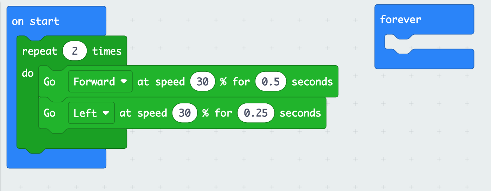

# Make A Square

## Only Half a Square. 

Enter this program to draw a square and run it to see what it does.

Hmm ... doesn't look like it makes a square. Maybe only half a square. Can you
fix the program to make a full square?

## For, Not Repeat

Look in the 

category for a for loop. Replace your repeat loop with a for loop. Then make
sure your program runs again.  

## Side Counter

 Your for loop has a variable called Index. Look in the 
  
 category for a way to display the number of the side while the robot is drawing a square. 

## Wait Patiently

 Your robot will start driving as soon as it is turned on, but if you move your for loop from the start block
 to the forever block and add  an if statement you can make the robot wait until you press the a button to start, and have it start drawing again when you press the button again. 

### Hint
You will probably need these blocks: 
 

 

Your robot does not like to wait, so make it show a sad face when it is waiting. 

Next: [Open your Eyes BatBot](sonar)
