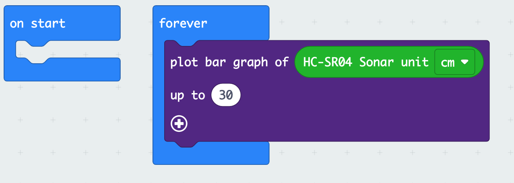

# Open Your Eyes BatBot

Actually, we should call this lesson "Open Your Ears" because we are 
going to use the cute "eyes" on the front of your robot, but these eyes are
actually ears. 

The two cylinders in the front of the Cutebot that look like eyes are a sonar module. One of the cylinders will emit a high-pitched sound, like a bat, and the other will listen for it. The time it takes for the sound to return 
lets the robot know how far away things are. You can read more of [the details about how this module works](https://randomnerdtutorials.com/complete-guide-for-ultrasonic-sensor-hc-sr04/). 

## Test Program

First, create a new project and load in the Cutebot extension. 

* Click on the   <MicrobitLogo/> to go back to the main page
* Click on the <NewProjectButton /> button, to start a new project. Let's call the program "BatBot". 
* In your new project, click on the <ExtensionsButton /> button.
* Select the Cutebot extension. When you return to the project page, your blocks menu in the middle of the should have a new  entry.

Enter and download this program: 

Move your hand in front of the sonar module. What do you see?

## Don't bump into things

Use the sonar to make the Cutebot avoid running into things. 

::: tip
Remember to turn the Cutebot off before you program it, or after you load the program it may scoot of the table. 
:::

::: details Hint

Use an if statement to check if the sonar reading is less than 10 or 15 cm. You will need to use two blocks
from the "Logic" category, one from the "Conditionals" group and one from the "Comparison" group. 

To make Cutebot avoid hitting things, you could have it stop, or back up and turn before going forward again. 

:::

## Use your headlamps

Turn on the large LEDs in the front of the Cutebot and set their colors
depending on what the robot is doing. For instance, maybe have one color for
turning, and other for backing up or going forward. 

## Make some noise

Try adding sounds to things that the Cutebot is doing. 

* Play a song when it finds a wall
* Play a song when it is backing up
* Play a tone depending on how far the wall is away. 

::: details Hint

There are many ways to play a tone, but to play a tone that depends on the
sonar measurement, you might use `map` in the 'Math' category and `ring tone`
from the 'Music' category.

:::

## Be unpredictable

Use "Math" `pick random` or `pick random True or False` to make the Cutebot
turn either right or left when it is avoiding a wall. 

## Be even more unpredictable

Think of other crazy things you can make your Cutebot do.
