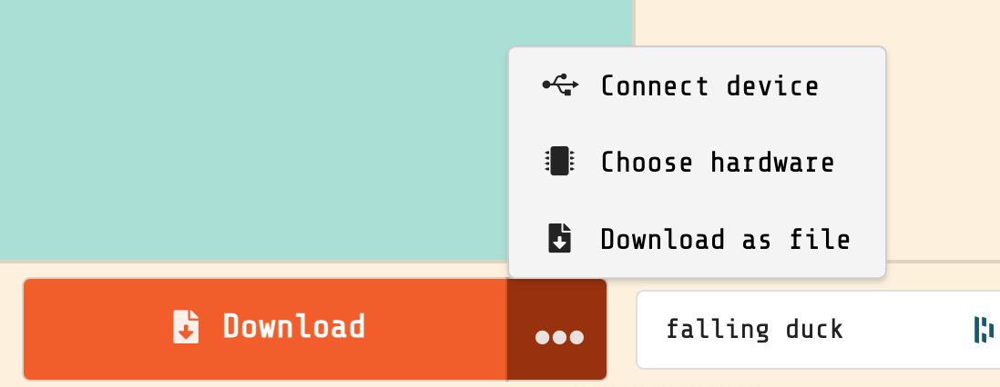
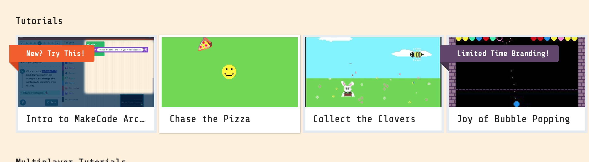

# Arcade

You can program video games on your Microbit, using specialized hardware that
looks like a portable game console. We use three different consoles, but 
the one we like best is the Meobit, so we have the most of them. 

## Elecfreeks Retro Programming Arcade

This device is a controller and screen for a Micro:bit; you will need to have a Micro:bit to plug into it. 

## Electfreeks Retro Arcade for Education

This handheld console looks a lot like the one your parents played as kids, but it has a Micro:bit inside of it. 

## Kittenbot Meowbit

The Meowbit is also a Micro:bit with a screen and buttons, but it also has a
connector under the white cover, so you can plug it into robots like a
regular Microbit. 

## Programming the Arcade

To Program these devices, you will need a different version of Makecode,
[Makecode Arcade](https://arcade.makecode.com). 

## Example Games

Here is a [large collection of Makecode games](https://github.com/makecode-extensions/arcade-games/tree/master)
that you can download and install. However, you will probably need some help form an instructor
to get them working. 

## Setup Your Arcade

Now lets load Bunny Hop onto our Micro:bit. Select one of the three game
controllers, then visit the [Bunny Hop](https://makecode.com/_XqaVLig0x5Cx) 
program. Click on the "Edit Code" button at the top of the screen to edit the code. 

Unfortunately, loading programs onto the arcade isn't always as easy as it is
with the other Micro:bit programs. For the Arcade, when you click "download"
button, it will download a file to your computer, and you will have to drag
that file into the USB drive created by plugging in the Micro:bit

### Load a Game

To load Bunny Hop on your console you should first select the hardware you
are using in the editor:

* Plug in the console to your computer. You should see a new drive available called "MICROBIT" or "ARCADE-F4"
* In the bottom-left of the Makecode Arcade editor, click on the '...' icon to select the hardware. 
* In the hardware, select the picture of the console you have. 

    
If you don't see the Micro:bit drive ("MICROBIT" or "ARCADE-F4") you might
    have to reset the console. Look for a small button or switch. On the Meowbit
    the button is on the right side under the orange rubber case and on the blue
    Retro it is the small button in front.

You should see either a game screen, or a blue and purple loading screen. You
might have to turn on a switch on the console if you don't see the screen.

Second, you will need to load the code onto the console. Click the '...' icon
again, and you will get this popup again: 

On the Meowbit you should see the "connect device" option. Select this and you
will be able to download directly to the Meowbit console. But for the other
two consoles, you will have to download the file to the computer. 

If you don't have the 'connect device' option when you click "Download" your
browser will download a file to the computer. When it is done downloading,
drag the file to the "MICROBIT" drive. 

# Play Bunny Hop

You can also play Bunny Hop on your computer to see what a typical Micro:bit Arcade game
 is like. You don't really need the game hardware to play the games.  You can play all of the Microbit games online, without loading them
 into your console, which makes it easier to program and debug them.  

<iframe style="position:absolute;top:0;left:0;width:100%;height:100%;" src="https://arcade.makecode.com/---run?id=_Th1FDAWymh1J" allowfullscreen="allowfullscreen" sandbox="allow-popups allow-forms allow-scripts allow-same-origin" frameborder="0"></iframe>

# Try The Tutorials

If you are unsure how to start, you can begin with some of the Makecode Arcade Tutorials.
 Visit the [Makecode Arcade](https://arcade.makecode.com/) home page and the look for 
 the tutorials a bit down the page. 

You should definitely try the Chase the Pizza Tutorial, and maybe one or two more.

When you feel like you've got it, move to the next lesson to work on a bigger game.  